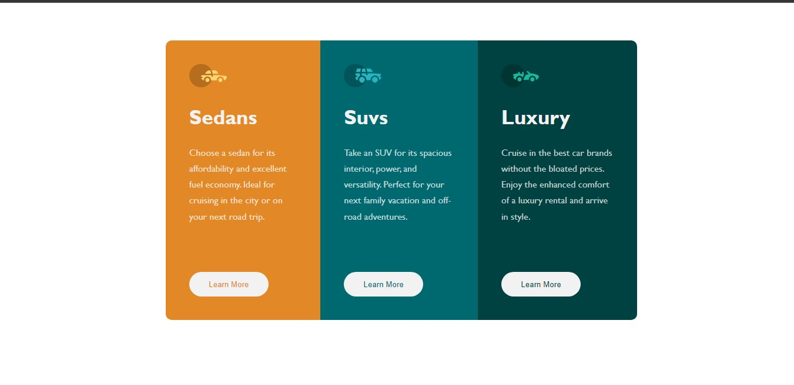

# Overview

The challenge was to build out this 3-column preview card component and get it looking as close to the design as possible.

Any tools I like can be used to complete the challenge.

I used the following to build this:

- Semantic HTML5 markup
- CSS custom properties
- Flexbox

## Screenshot

## Links

- Solution URL: [Add solution URL here](https://github.com/quest82/frontend-mentor_3-Column_Preview_Card)
- Live Site URL: [3-Column_Preview_Card](https://quest82.github.io/frontend-mentor_3-Column_Preview_Card/)

## Author

- Frontend Mentor - [@quest82](https://www.frontendmentor.io/profile/quest82)
- Twitter - [@Who_iz_Sammy](https://www.twitter.com/Who_iz_Sammy)
